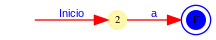
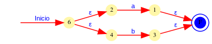
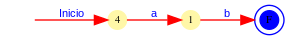
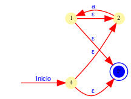
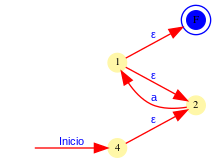
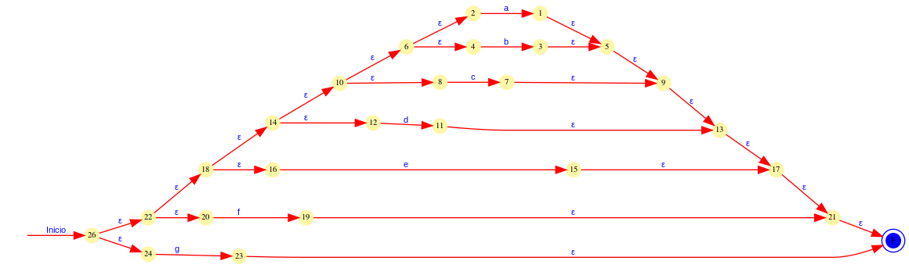
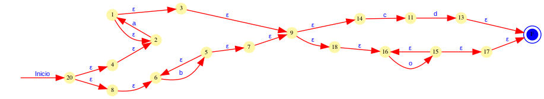

# Compilers

## Thompson Constructions

Regex = a

 

Regex = a|b

 

Regex = ab

 

Regex = a*

 

Regex = a+

 

Regex = a|b|c|d|e|f|g

 

Regex = (a+|b+)(cd|o+)

 

## Regex to AFD

Regex = a|b

 

