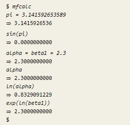
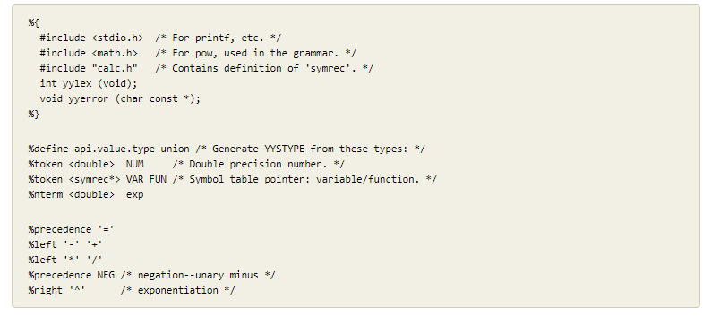
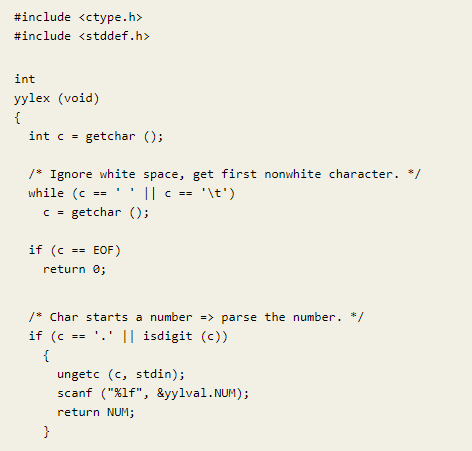
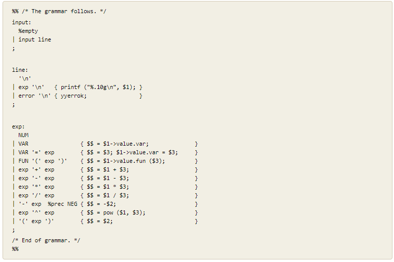
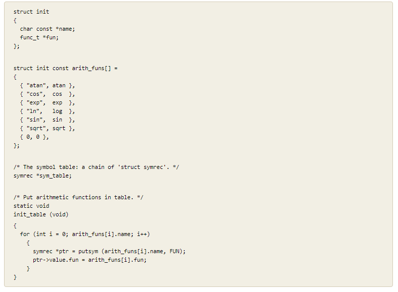
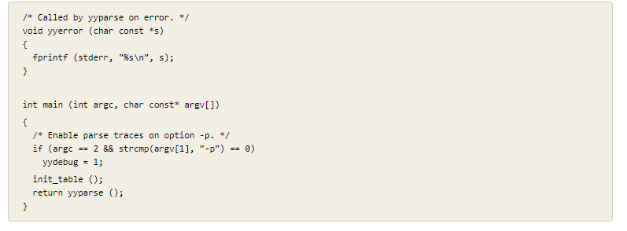

# Compilers

## Thompson Constructions

Regex = a

 

Regex = a|b

 

Regex = ab

 

Regex = a*

 

Regex = a+

 

Regex = a|b|c|d|e|f|g

 

Regex = (a+|b+)(cd|o+)

 

## Regex to AFD

Regex = a|b

 

Regex = ab

 

Regex = a*

 

Regex = a+

 

Regex = a+|b+

 

Regex = (a+|b+)cd

 

Regex = (a+|b+)cd(a+b+)

 

Regex = (c+o+r+o+n+a+v+i+r+u+s+)|(c+o+v+i+d+1+9+)

 

Regex = ((git)|(hub)|(github*)|(c+o+v*i*d+1*9))

 

## Multi-Function Calculator: mfcalc

Mfcalc

 

Declaration for mfcalc

 

mfcalc Lexer

 

Grammar Rules

 

Symbol Table

 

Mfcalc Main

 

